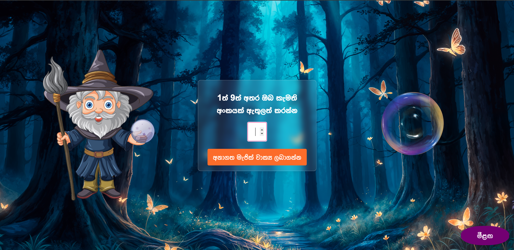

# Magical Fact Wizard

This is a simple web application that allows users to input a number between 1 and 9 and receive a random fact along with an image. The application includes an animated wizard image and a magic ball image that rotates slowly. Additionally, the application supports keyboard interactions, allowing users to use the Enter key and the right Shift key to interact with the buttons.

## Features

- Input a number between 1 and 9 to receive a random fact.
- Displays a loading animation before showing the fact.
- Changes the wizard image after the loading animation.
- Rotates the magic ball image slowly.
- Supports keyboard interactions:
  - Press Enter to show the fact.
  - Press the right Shift key to reset the screen.
- Responsive design with a visually appealing background.

## Installation

1. Clone the repository:
    ```sh
    git clone https://github.com/chanukagayantha/Magical-Fact-Wizard.git
    ```

2. Navigate to the project directory:
    ```sh
    cd random-fact-generator
    ```

3. Open the `index.html` file in your web browser to run the application.

## Usage

1. Open the application in your web browser.
2. Enter a number between 1 and 9 in the input field.
3. Press the Enter key or click the "අනාගත මැජික් වාක්‍ය ලබාගන්න" button to receive a random fact.
4. The application will display a loading animation for 3 seconds.
5. After the loading animation, the wizard image will change, and a random fact along with an image will be displayed.
6. Press the right Shift key or click the "මීළඟ" button to reset the screen.

## Files

- `index.html`: The main HTML file that structures the web page.
- `styles.css`: The CSS file that styles the web page.
- `script.js`: The JavaScript file that contains the main logic and interactions.
- `images/`: The directory containing the wizard and magic ball images.
- `facts.json`: A JSON file containing the random facts and images.

## Example

Here is an example of how the application looks:



## License

This project is licensed under the MIT License. See the [LICENSE](LICENSE) file for details.

## Contributing

Contributions are welcome! Please feel free to submit a pull request or open an issue if you have any suggestions or improvements.

## Contact

If you have any questions or feedback, feel free to contact the project maintainer.

---

Enjoy the Magical Fact Generator!
